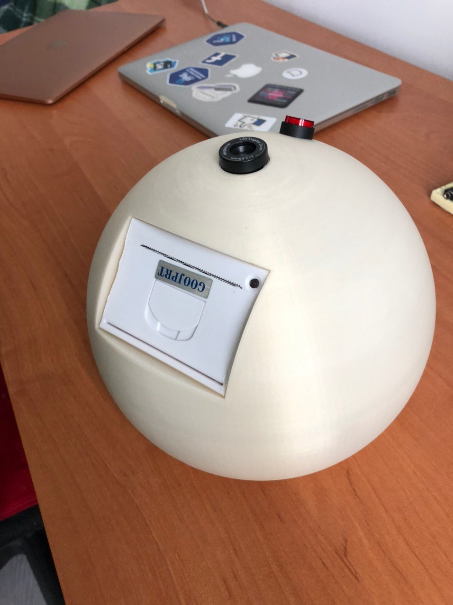
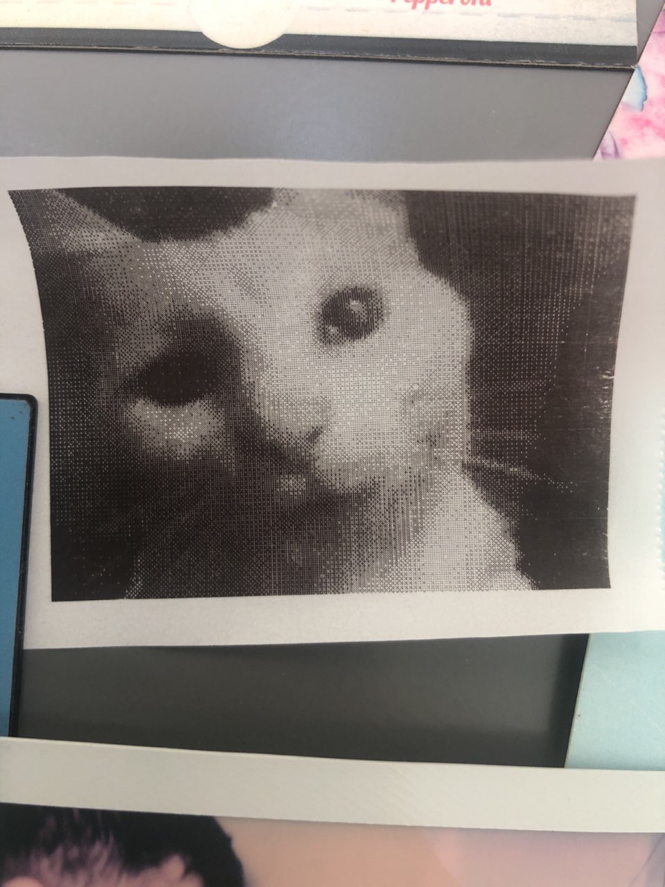

# Poor Man's Polaroid
Orange Pi Zero based device that captures photos using cheap web camera as well as printing it using cheap thermal printer 

# What does it mean?
The project was inspired by [Mitxela's Thermal Paper Polaroid](https://mitxela.com/projects/thermal_paper_polaroid) and it's pretty same functionality device, but with own enclosure and custom button. Only one button with status LED inside as control device, cheap webcam for capturing and cheap thermal printer for printing the result.

# Components
- [Orange Pi Zero](https://ru.aliexpress.com/item/4000049806939.html) (Or some other cheap single-board PC)
- [Cheap Thermal Printer with USB or RS-232 interface](https://ru.aliexpress.com/item/4000022056557.html) (As well as above item you can use any cheaper or better alternative)
- [Button w/ or w/o LED inside](https://ru.aliexpress.com/item/32850614630.html)
- [Web Camera](defender-global.com/catalog/webcams/c-110-0-3mp-backlight-photo-button) (Any supported and affordable camera)

# How To
- Install the OS on your single-board PC (https://www.armbian.com/ for my case)
- Connect to your single-board PC via SSH or attach keyboard/monitor for more comfortable setup actions
- Install `fswebcam` (`sudo apt-get install fswebcam`) and connect your webcam
- (optional) Install drivers for your webcam in needed
- Connect and configure your printer (very usefull link https://learn.adafruit.com/networked-thermal-printer-using-cups-and-raspberry-pi/connect-and-configure-printer)
- Connect button (for my case `PA.10` pin is used as input and connected to one button's pin and another pin is connected to 3.3V pin)
- (optional) Connect button's LED or separate LED (for my case `PA.14` pin is connected to LED's + terminal and GND pin to LED's - terminal)
- Copy [app](app/) folder to your single-board PC (or just clone this repo to your single-board PC)
- Install requirements for Python script (`pip install -r requirements.txt`)
- Change GPIO lib setup inside script to fit your wiring
- Add `main.py` file to crontab for run after single-board PC boot (https://www.cyberciti.biz/faq/linux-execute-cron-job-after-system-reboot/). So my crontab have only one line: `@reboot python /home/kami/printer/main_app/main.py`, where `/home/kami/printer/main_app/main.py` is a path to `main.py` file
- Enjoy your DIY Poor Man's Polaroid

# What about enclosure?
You can use your own encloure for this project. I have a 3D printed model for my device enclosure, but while installation I had to file it a bit to place my thermal printer. I'll add it after few fixed or AS IS for community improvements.

# Ok. It's pretty clear. But why?
Because every photo costs as a sip of cofee. Literally. Or even cheaper.

# What about output for this piece of gold?
This photo shooted on my vintage Polaroid and it costs around few cups of good cofee:

And below is a photo taken on Poor Man's Polaroid:

# Contribution
Feel free to add suggestions, fork and improve this project.

Many thanks to my good pal [@megabotan](https://github.com/megabotan) for help
